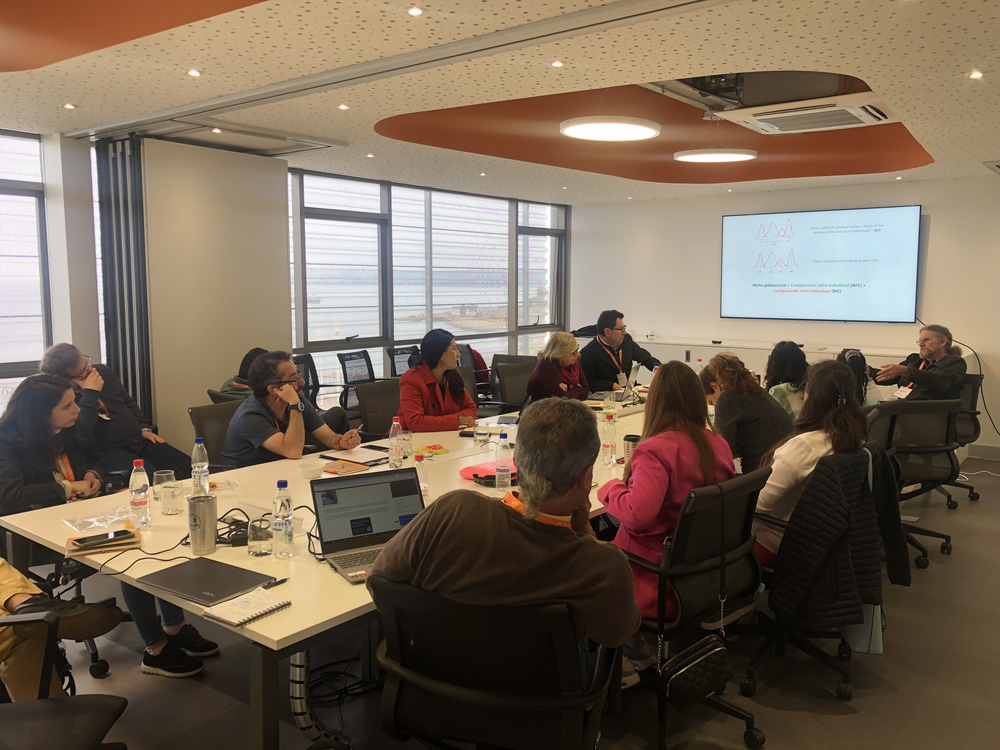

> *Ecostat es un Workshop sobre Avances en Estadística para Ecología, donde participé como Keynote Speaker*.

**Ecostat** es un pequeño Workshop sobre Avances en Estadística para Ecología, que reune a investigadores interesados en problemas que estan en el borde entre la ecología y la estadística. 
 El evento  fue realizadó entre el 24 y 25 del 2022 en la [Universidad Técnica Federico Santa María](http://www.usm.cl) (UTFSM), en Valparaíso, Chile.  Esta edición del workshop fue organizado por el Profesor
de la UTFSM, el Dr. Ronny Vallejos y el Profesor (retirado recientemente) de Harvard University, el Dr. Aaron Ellison.
El [programa](https://eco-stat.github.io) muestra una gran variedad de tópicos cubiertos por
investigadores nacionales e internacionales.

 Fui invitadó como un Keynote Speaker y presente  la charla 
   "*Building a dynamic growth model for natural forests in south-central Chile*".
Durante los días del Workshop discutimos sobre diferentes alternativas para enfrentar el análisis de problemas ecológicos, así como los permanentes desafíos que se presentan. Además, como siempre, fue **motivante** y desafiante la charla de Aaron, esta vez sobre diversidad y heterogeneidad. 

Quiero agradecer al  [Centro Avanzado de Ingeniería Eléctrica y Electrónica (AC3E)](https://ac3e.usm.cl) y al Departamento de Matemática de la UTFSM, y en especial a Ronny por la organización de este encuentro, desde donde nacieron  estimulantes conversaciones derivadas de cada charla, y a todos los colegas que asistieron.

<!--- 
- **Create** slides using Wowchemy's [_Slides_](https://wowchemy.com/docs/managing-content/#create-slides) feature and link using `slides` parameter in the front matter of the talk file
- **Upload** an existing slide deck to `static/` and link using `url_slides` parameter in the front matter of the talk file
- **Embed** your slides (e.g. Google Slides) or presentation video on this page using [shortcodes](https://wowchemy.com/docs/writing-markdown-latex/).

{}
Click on the **Slides** button above to view the built-in slides feature.
{}

> *La [IUFRO](www.iufro.org) es la Unión Internacional de Organizaciones de Investigación Forestal, y se organiza en divisiones y secciones
disciplinarias. Por
ejemplo la Division 4 es sobre Evaluación, Modelación y Manejo.*
-->