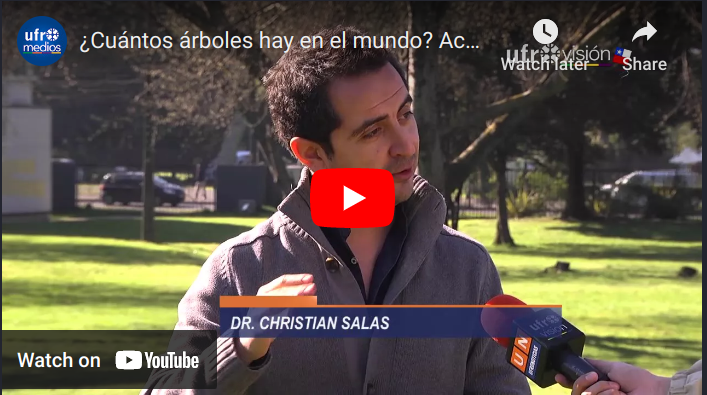

> *Reportaje ¿Cuántos árboles hay en el mundo?, realizado por el canal de televisión UfroVision* 

 Posteado: 15 de septiembre, 2015

---

Este reportaje realizado por el canal de television de la Universidad de La Frontera, fue motivado por nuestra [investigación publicada](https://www.nature.com/articles/nature14967) en la revista *Nature* por un grupo de investigadores alrededor del mundo, para estimar la densidad de árboles en nuestro planeta. 

<html>
   <body>
      Pinhca sobre la imagen para ver el video en YouTube: 
      
   </body>
</html>

<!--- 

#### Te parecio interesante o util? Considera compartirlo 🙌
<iframe width="560" height="315" src="https://www.youtube.com/embed/RN68ROe_5JM" frameborder="0" allow="accelerometer; autoplay; clipboard-write; encrypted-media; gyroscope; picture-in-picture" allowfullscreen></iframe>

**Some of my older websites**
- [My old website](https://cseljatib.wixsite.com/biometria)
- [My old linux help](http://biometria.ufro.cl/myLinuxHelp/)
* [Mentoirs](./educa.md)

-->
