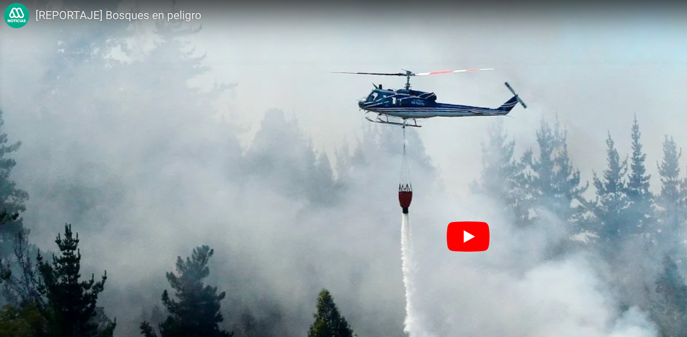

> *Reportaje "Bosques en peligro", sobre los incendios forestales que afectarón durante la temporada estival al centro del país. realizado por el canal de televisión Mega* 

 Posteado: 10 de marzo, 2017

---

Reportaje del periodista [Anwar Farrán](https://twitter.com/Anwar_Farran), donde entrevista a diferentes actores relacionados a los Mega-incendios forestales del 2017 en el centro del País, así como una serie de otros aspectos que se interrelacionan. Dentro del ámbito académico, participó en el marco del trabajo desarrollado por mis colegas Drs. Andrés Fuentes y Rodrigo Vargas.

<html>
   <body>
      Pinhca sobre la imagen para ver el video en YouTube: 
    
   </body>
</html>

<!--- 
<iframe width="560" height="315" src="https://www.youtube.com/embed/ajZvZ6mbipw" frameborder="0" allow="accelerometer; autoplay; clipboard-write; encrypted-media; gyroscope; picture-in-picture" allowfullscreen></iframe>

#### Te parecio interesante o util? Considera compartirlo 🙌

**Some of my older websites**
- [My old website](https://cseljatib.wixsite.com/biometria)
- [My old linux help](http://biometria.ufro.cl/myLinuxHelp/)
* [Mentoirs](./educa.md)

-->
